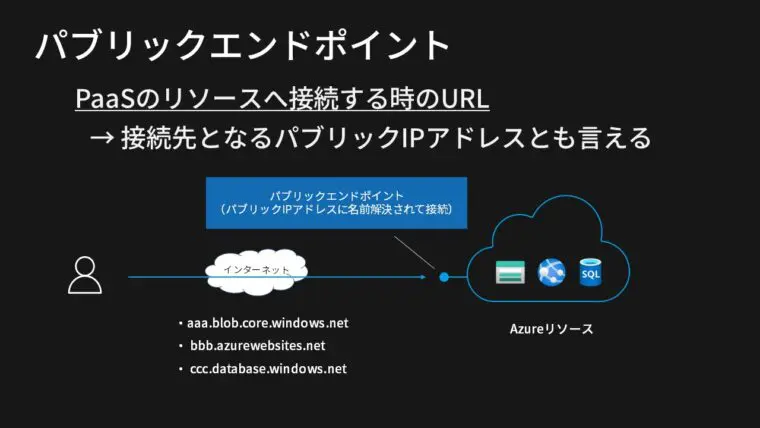
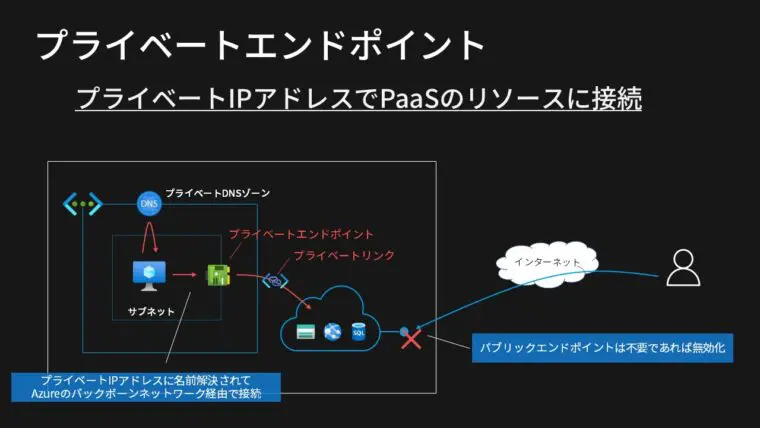
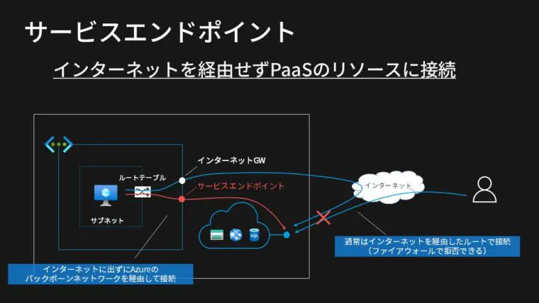

# Overview
- [Overview](#overview)
- [Basic Configuration](#basic-configuration)
  - [Tenant vs Resource Group vs Subscription](#tenant-vs-resource-group-vs-subscription)
- [Performance](#performance)
  - [Performance Metrics](#performance-metrics)
- [Security](#security)
  - [Azure Security基本的な考え方](#azure-security基本的な考え方)
  - [Azure blob storage のアクセス方法について](#azure-blob-storage-のアクセス方法について)
    - [Authentication methods for blob storages](#authentication-methods-for-blob-storages)
    - [Linux VM のシステム割り当てマネージド ID を使用して Azure Storage にアクセスする(System Managed ID)](#linux-vm-のシステム割り当てマネージド-id-を使用して-azure-storage-にアクセスするsystem-managed-id)
    - [サービスプリンシパル / クライアントID / プリンシパルID](#サービスプリンシパル--クライアントid--プリンシパルid)
- [Azure Storage](#azure-storage)
  - [AzureStorageManagerのストレージタイプとは具体的にどういう意味を持つのか？](#azurestoragemanagerのストレージタイプとは具体的にどういう意味を持つのか)
  - [データの移行方法](#データの移行方法)
  - [Azure Cli集](#azure-cli集)
- [Network](#network)
  - [PointToSiteVPNとBastionの使い分けについて](#pointtositevpnとbastionの使い分けについて)
  - [NetworkSecurityGroupについて](#networksecuritygroupについて)
  - [AzureBastionについて](#azurebastionについて)
  - [エンドポイントについて](#エンドポイントについて)
  - [AWSからAzureに接続する方法](#awsからazureに接続する方法)
  - [Azureにルートテーブルという概念が存在するのか](#azureにルートテーブルという概念が存在するのか)
  - [NatGWの作成方法](#natgwの作成方法)
- [AI](#ai)
  - [Azure Open AI](#azure-open-ai)
    - [Network](#network-1)
    - [Pricing Tier](#pricing-tier)

# Basic Configuration
## Tenant vs Resource Group vs Subscription
* Tenant
  The root of Microsoft Services, including azure Micorsoft 365 and users. It is also the same as Azure Active Directory instance, which stores users and group information
  A single tenant can contain several subscritions
* Subscription
 A subscription is linked to a payment method, and can hold several azure resources. 
* Resource group
 A logical container within a subscription that organizes each resources. You can create multiple resouce groups within a subsciption to segregate resources  

# Performance 
## Performance Metrics
https://jpaztech.github.io/blog/vm/disk-metrics/

# Security
## Azure Security基本的な考え方  
サブスクリプションに対してフル権限を与えてしまうと中のリソースに対してもフル権限が渡ってしまう。だからこそ、サブスクリプションなどは弱い権限を与えて中の
リソースグループに対して強い権限を与えるようにするべき

## Azure blob storage のアクセス方法について

### Authentication methods for blob storages
- Shared Key Authentication
- Managed Identity
- Service Principal and Client Secret (※1)
- Shared Access Signature (SAS)
- Managed Identity
- Service Principal and Client Secret  
(※1) Azure AD側で設定するもの


 **1. Grant limited access to Azure Storage resources using shared access signatures (SAS)**

 **2. Shared Key authorization**  
 A client using Shared Key passes a header with every request that is signed using the storage account access key.
Microsoft recommends that you disallow Shared Key authorization for your storage account. When Shared Key authorization is disallowed, clients must use Azure AD or a user delegation SAS to authorize requests for data in that storage account.   

**3. Azure Active Directory (Azure AD) integration
Use "user management ID or**

**what is azure rbac?**
Azure RBAC is an authorization system built on Azure Resource Manager that provides fine-grained access management to Azure resources.

### Linux VM のシステム割り当てマネージド ID を使用して Azure Storage にアクセスする(System Managed ID)
ターミナル ウィンドウで、CURL を使用して、ローカルのマネージド ID エンドポイントに対して Azure Storage のアクセス トークンを取得するよう要求します。
curl 'http://169.254.169.254/metadata/identity/oauth2/token?api-version=2018-02-01&resource=https%3A%2F%2Fstorage.azure.com%2F' -H Metadata:true
このアクセス トークンを使用して Azure Storage にアクセスします。たとえば、コンテナーに事前にアップロードされたサンプル ファイルの内容を読み取るなどです。 <STORAGE ACCOUNT>、<CONTAINER NAME>、<FILE NAME> の値を、以前に指定した値で置き換えます。<ACCESS TOKEN> は、前の手順で返されたトークンに置き換えます。

### サービスプリンシパル / クライアントID / プリンシパルID

**サービスプリンシパル**
Azure AD側の概念。単一のテナントまたはディレクトリ内のグローバル アプリケーション オブジェクトのローカル表現、つまりアプリケーション インスタンス（公式Docより引用だが、触ったことがないのでちょっと何のこといってるのかよくわからない・・後述  
**クライアントID**  
Azure ADによって生成される一意識別子  
**プリンシパルID**  
マネージドIDに対するサービスプリンシパルオブジェクトのオブジェクトID。AzureリソースへのRBAC(ロールベースアクセス制御）付与に利用される  
**Azure Instance Metadata Service (IMDS)**
Azure Resource Manager を使用して作成されたすべての IaaS VM にアクセスできる REST エンドポイント

##　Azure権限について
https://zenn.dev/tomot/articles/6528bccdfbe546#%E3%81%AF%E3%81%98%E3%82%81%E3%81%AB  
**azlogin --idenitityとは？**  
ManagedIDを有効化させるためのモノとなっている

**Azure AD RBAC**  
Azure AD上の設定で、所属しているユーザーに対して「Azure ADロール」を割り当てます。最強権限のAzure ADロールは、英語で"Global Administrator"／日本語で"グローバル管理者"なのですが、ドキュメント上、時々ですが"全体管理者"という言葉になって出てくることがあります。  
**Azure RBAC**  
この仕組みが、Azure RBACです。Azure AD RBACと違い、各ドキュメントにも頻繁に出てくる概念ですので、しっかり覚えましょう。
Azure RBACでは、先ほど「IAM」で設定する3つの要素がポイントとなります。すなわち、
誰が：セキュリティプリンシパル
何処に：スコープ
どういう権限で：ロール
の3つです。
なお、冒頭で話した通り、AzureADのロールとAzureのロールは無関係です。そのため、Azure ADに対しては何も権限を持っていないけど、Azureのリソースは何でもいじれることもあり得ますし、逆にAzure ADでユーザー管理をすることはできてもAzure側のリソースは参照すら出来ない、なんていう設定も可能です。


# Azure Storage 
## AzureStorageManagerのストレージタイプとは具体的にどういう意味を持つのか？
　→テーブルとCosmosDBの違い？

## データの移行方法

## Azure Cli集
```bash
# upload storage account 
az storage blob upload \
 --account-name <ストレージアカウント名> \
 --account-key <アクセスキー> \
 --container-name <コンテナ名> \
 --type block \
 --source <ローカルファイルパス> \
 --destination <リモートファイルパス>\

### make sure that --auth-mode is login
az storage container list --account-name thkdevsatest001 --auth-mode login
curl "https://thkdevsatest001.blob.core.windows.net/test-container/example1.txt" \
  -H "x-ms-version: 2017-11-09" \
  -H "Authorization: Bearer $access_token"

az storage container \
    --sas-token <token>\
    --account-key <key>\
    --auth-mode key\
    --auth-mode login
```


# Network
## PointToSiteVPNとBastionの使い分けについて
Azure BastionはP2S VPNと違ってAzureの中のサービスについて利用する事が出来ないのがデメリット

## NetworkSecurityGroupについて
　サブネットとNICにつけることが可能
　一つのNSGを複数のNICに関連付けることは可能です。
　　例えば、サーバＡとサーバＢに同じNSGを関連付けることが可能です。
　　ただし、複数のNSGを一つのNICに関連付けることは出来ません
　NSGは数字が高い方が優先されない

## AzureBastionについて
　AzureBastion用のサブネットを立てることによってVnet内のＶＭに接続を可能とする

## エンドポイントについて
　→VMからCosmosDB / BlobStorageに繋げる方法
　　BlobStorage
　　　サービスエンドポイントとパブリックエンドポイントの二種類が存在する。サービスエンドポイントだとVnet内のリソースが名前解決をすることが可能しかし、パブリックエンドポイントだとVPNやExpressRouteからの接続では実現できない  
  
  
**サービスエンドポイントとプライベートエンドポイントとパブリックエンドポイントの違いについて**  
| エンドポイント             | 経路                                                    |
| :------------------------- | :------------------------------------------------------ |
| パブリックエンドポイント   | インターネットを経由してパブリックIPアドレスで接続      |
| サービスエンドポイント     | Azureバックボーンを経由してパブリックIPアドレスで接続   |
| プライベートエンドポイント | Azureバックボーンを経由してプライベートIPアドレスで接続 |





## AWSからAzureに接続する方法
前提：AWSとAzureはVPN同士で接続して行う  
**Blobストレージに接続する場合**  
AzureのBlobストレージのSASトークンを利用してAPIキーを利用する  
**AzureOpenAIの場合**


  
 

  

## Azureにルートテーブルという概念が存在するのか
　→存在する。インターネットGW/NatGW/FastConnectの為に利用する

## NatGWの作成方法
　→NATのIPアドレスをサブネットに紐づけて

# AI
## Azure Open AI
Azure Open AIを作成する事によってAzureOpenAI Studioを作成する事ができる
### Network
ネットワークについて以下の三つから選ばなくてはいけない  
　- インターネットを含むすべてのネットワークがこのリソースにアクセスできます。　　
　- 選択されているネットワーク。Cognitive Services リソースのネットワーク セキュリティを構成します。  
　- 無効になっています。どのネットワークもこのリソースにアクセスできません。このリソースにアクセスする唯一の方法となるプライベート エンドポイント接続を構成できます。 
  
<text style="color: red; "> **配置するサブネットについてはサービスエンドポイント：Microsoft Cognitive Serviceが必要**</text>  
今回は2番目を選択

⇒AzureOpenAIStudioについてコンソールからアクセスする事が出来ない / Public IPを許可することによって接続を可能とする

疑問：AWSからの接続など完全なる第三のベンダーから接続する際にサービスエンドポイントやプライベートエンドポイントを必要とするか

### Pricing Tier
Token毎に値段が変化する　


