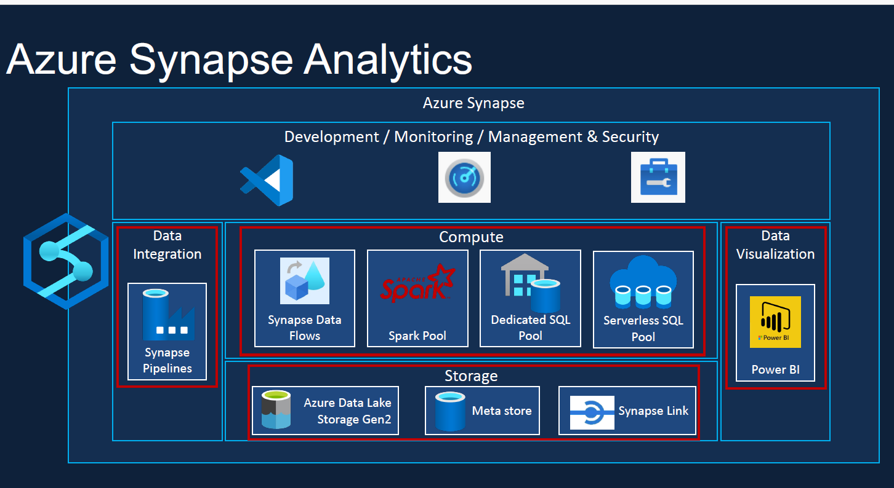

# Overview
- [Overview](#overview)
- [Basic Configuration](#basic-configuration)
  - [Tenant vs Resource Group vs Subscription](#tenant-vs-resource-group-vs-subscription)
- [Performance](#performance)
  - [Performance Metrics](#performance-metrics)
- [Security](#security)
  - [Azure Security基本的な考え方](#azure-security基本的な考え方)
  - [Azure blob storage のアクセス方法について](#azure-blob-storage-のアクセス方法について)
    - [Authentication methods for blob storages](#authentication-methods-for-blob-storages)
    - [Linux VM のシステム割り当てマネージド ID を使用して Azure Storage にアクセスする(System Managed ID)](#linux-vm-のシステム割り当てマネージド-id-を使用して-azure-storage-にアクセスするsystem-managed-id)
    - [サービスプリンシパル / クライアントID / プリンシパルID](#サービスプリンシパル--クライアントid--プリンシパルid)
- [Azure Storage](#azure-storage)
  - [AzureStorageManagerのストレージタイプとは具体的にどういう意味を持つのか？](#azurestoragemanagerのストレージタイプとは具体的にどういう意味を持つのか)
  - [データの移行方法](#データの移行方法)
  - [Azure Cli集](#azure-cli集)
- [Network](#network)
  - [PointToSiteVPNとBastionの使い分けについて](#pointtositevpnとbastionの使い分けについて)
  - [NetworkSecurityGroupについて](#networksecuritygroupについて)
  - [AzureBastionについて](#azurebastionについて)
  - [エンドポイントについて](#エンドポイントについて)
  - [AWSからAzureに接続する方法](#awsからazureに接続する方法)
  - [Azureにルートテーブルという概念が存在するのか](#azureにルートテーブルという概念が存在するのか)
  - [NatGWの作成方法](#natgwの作成方法)
- [AI](#ai)
  - [Azure Open AI](#azure-open-ai)
    - [Network](#network-1)
    - [Pricing Tier](#pricing-tier)


# TODO
- [x] Create a Cluster and run a notebook on the cluster
- [x] Use a python utility to show the COVID Folders
- [x] How to use a unity catalog
- [x] How to connect to a data lake gen2 via private access
- [] What to do when you want to change your scale types?
- [] Difference between AWS Key vaults and Azure key vaults 
- [] How to divide the production and development environment in the Azure Databricks environment
- []  データの開発方法について（データをAzureDatabricksのworkspace上で弄ってはいけない要件をどのようにクリアするか）
- []  How to set the access policy when making multiple azure storag accounts 
- [] CI-CD環境
- [] How to set the kernel in azure machine Learning
- [] Azure DatabricksとAzureMachine Learning のカーネルの使い方について
- [] Azure DatabricksとAzure Machine Learning のジョブの動かし方について


# Basic Configuration
## Tenant vs Resource Group vs Subscription
* Tenant
  The root of Microsoft Services, including azure Micorsoft 365 and users. It is also the same as Azure Active Directory instance, which stores users and group information
  A single tenant can contain several subscritions
* Subscription
 A subscription is linked to a payment method, and can hold several azure resources. 
* Resource group
 A logical container within a subscription that organizes each resources. You can create multiple resouce groups within a subsciption to segregate resources  

### How to organize your Management Group
https://learn.microsoft.com/en-us/azure/cloud-adoption-framework/ready/landing-zone/design-area/resource-org-management-groups  
Management group structures within a Microsoft Entra tenant support organizational mapping. Consider your management group structure thoroughly when your organization plans its Azure adoption at scale.
* Determine how your organization separates out services that specific teams own or operate.
* Determine whether you have specific functions that you need to keep separate for reasons like business requirements, operational requirements, regulatory requirements, data residency, data security, or data sovereignty compliance.
* Use management groups to aggregate policy and initiative assignments via Azure Policy.
* Enable Azure role-based access control (RBAC) authorization for management group operations to override the default authorization. By default, any principal, like a user principal or service principal, within a Microsoft Entra tenant can create new management groups. For more information, see How to protect your resource hierarchy.  
<b>Also consider the following factors:</b>
* A management group tree can support up to six levels of depth. This limit doesn't include the tenant root level or the subscription level.
* All new subscriptions are placed under the tenant root management group by default.

### How to organize your Subscription
* Subscription limits: Subscriptions have defined limits for some resource types. For example, the number of virtual networks in a subscription is limited. When a subscription approaches these limits, you'll need to create another subscription and put additional resources there. For more information, see Azure subscription and service limits.
* Classic model resources: If you've been using Azure for a long time, you may have resources that were created using the classic deployment model. Azure policies, Azure role-based access control, resource grouping, and tags cannot be applied to classic model resources. You should move these resources into subscriptions that contain only classic model resources.
* Costs: There might be some additional costs for data ingress and egress between subscriptions.

### How to organize your resource group
Environment separation  
You might have separate resource groups for different environments like Development, Testing, Staging, and Production. It provides clear isolation between environments and ensures that actions (like deployments or tests) in one environment don’t impact others.

Lifecycle and management  
Resources with different lifecycles or managed by different teams should be in separate resource groups. For example, you might have an application that’s updated frequently and a database that rarely changes. Putting them in different resource groups allows you to manage and version them independently.

Access control  
If you have different teams or individuals that need specific access to certain resources but not others, use separate resource groups to provide a more granular level of access control.

Geographical distribution  
If you have resources deployed across different geographical regions, it may make sense to group them by their location for easier management, cost tracking, and compliance with data sovereignty requirements.

Billing purposes  
You can group resources based on the cost center or department they belong to, enabling more precise cost allocation and tracking.

Resource organization strategies  
A common pitfall when starting with Azure Resource Groups is overlooking the importance of a well-planned structure. Without careful planning, resource groups can quickly become cluttered, leading to inefficiencies and potential security issues.


# Performance 
## Performance Metrics
https://jpaztech.github.io/blog/vm/disk-metrics/

# Security
## Azure Security基本的な考え方  
サブスクリプションに対してフル権限を与えてしまうと中のリソースに対してもフル権限が渡ってしまう。だからこそ、サブスクリプションなどは弱い権限を与えて中の
リソースグループに対して強い権限を与えるようにするべき

## Azure blob storage のアクセス方法について

### Authentication methods for blob storages
- Shared Key Authentication
- Managed Identity
- Service Principal and Client Secret (※1)
- Shared Access Signature (SAS)
- Managed Identity
- Service Principal and Client Secret  
(※1) Azure AD側で設定するもの


 **1. Grant limited access to Azure Storage resources using shared access signatures (SAS)**

 **2. Shared Key authorization**  
 A client using Shared Key passes a header with every request that is signed using the storage account access key.
Microsoft recommends that you disallow Shared Key authorization for your storage account. When Shared Key authorization is disallowed, clients must use Azure AD or a user delegation SAS to authorize requests for data in that storage account.   

**3. Azure Active Directory (Azure AD) integration
Use "user management ID or**

**what is azure rbac?**
Azure RBAC is an authorization system built on Azure Resource Manager that provides fine-grained access management to Azure resources.

### Linux VM のシステム割り当てマネージド ID を使用して Azure Storage にアクセスする(System Managed ID)
ターミナル ウィンドウで、CURL を使用して、ローカルのマネージド ID エンドポイントに対して Azure Storage のアクセス トークンを取得するよう要求します。
curl 'http://169.254.169.254/metadata/identity/oauth2/token?api-version=2018-02-01&resource=https%3A%2F%2Fstorage.azure.com%2F' -H Metadata:true
このアクセス トークンを使用して Azure Storage にアクセスします。たとえば、コンテナーに事前にアップロードされたサンプル ファイルの内容を読み取るなどです。 <STORAGE ACCOUNT>、<CONTAINER NAME>、<FILE NAME> の値を、以前に指定した値で置き換えます。<ACCESS TOKEN> は、前の手順で返されたトークンに置き換えます。

### サービスプリンシパル / クライアントID / プリンシパルID

**サービスプリンシパル**
Azure AD側の概念。単一のテナントまたはディレクトリ内のグローバル アプリケーション オブジェクトのローカル表現、つまりアプリケーション インスタンス（公式Docより引用だが、触ったことがないのでちょっと何のこといってるのかよくわからない・・後述  
**クライアントID**  
Azure ADによって生成される一意識別子  
**プリンシパルID**  
マネージドIDに対するサービスプリンシパルオブジェクトのオブジェクトID。AzureリソースへのRBAC(ロールベースアクセス制御）付与に利用される  
**Azure Instance Metadata Service (IMDS)**
Azure Resource Manager を使用して作成されたすべての IaaS VM にアクセスできる REST エンドポイント

##　Azure権限について
https://zenn.dev/tomot/articles/6528bccdfbe546#%E3%81%AF%E3%81%98%E3%82%81%E3%81%AB  
**azlogin --idenitityとは？**  
ManagedIDを有効化させるためのモノとなっている

**Azure AD RBAC**  
Azure AD上の設定で、所属しているユーザーに対して「Azure ADロール」を割り当てます。最強権限のAzure ADロールは、英語で"Global Administrator"／日本語で"グローバル管理者"なのですが、ドキュメント上、時々ですが"全体管理者"という言葉になって出てくることがあります。  
**Azure RBAC**  
この仕組みが、Azure RBACです。Azure AD RBACと違い、各ドキュメントにも頻繁に出てくる概念ですので、しっかり覚えましょう。
Azure RBACでは、先ほど「IAM」で設定する3つの要素がポイントとなります。すなわち、
誰が：セキュリティプリンシパル
何処に：スコープ
どういう権限で：ロール
の3つです。
なお、冒頭で話した通り、AzureADのロールとAzureのロールは無関係です。そのため、Azure ADに対しては何も権限を持っていないけど、Azureのリソースは何でもいじれることもあり得ますし、逆にAzure ADでユーザー管理をすることはできてもAzure側のリソースは参照すら出来ない、なんていう設定も可能です。


# Azure Storage Account

## Azure Blob storage Replicaiton / Versioning / Snapshot / Soft Delete(論理的な削除)
- Replication: It will replicate the blob into a specific different blob container.
- Versioning: It will create a version whenever change is made to the uploaded blob.
https://learn.microsoft.com/ja-jp/azure/storage/blobs/versioning-overview
Versioning retention depends on the lifecycle management.

- Snapshot: It will create a specific time stamp for when the blob. Snapshot can be created unlimited amount of times and It will be retended until the base blob is deleted with the snapshot.
- Soft Delete: It will create a timestamp for when the blob is deleted so you can recreate the blob again.

## AzureStorageManagerのストレージタイプとは具体的にどういう意味を持つのか？


## クロステナントのAzure アカウント連携
 <b>要約</b>  
 Vnet に配置されているVM（TenantA）が一つと別のテナント(TentantB)に接続する際は
 1. TenantBのストレージアカウントのリソースIDを取得
 2. プライベートエンドポイントをTenantAで作成し、１を入力する
 3. TenantBで２を承認
 4. プライベートエンドポイントにエイリアスレコードを追加する  
 5. クロステナントの場合はマネージドIDでの認証はできないのでアクセスキーかSASでのアクセスになりそうですね
https://qiita.com/shingo_kawahara/items/3fb70196a8165cbf9cf1

### クロスサブスクリプションの場合
1. クロステナントと同じような手順でネットワーク的な接続は可能
2. SASやキーに加えてマネージドIDでの認証も可能になる

## Azure Blob vs Azure Datalake Storage Gen2
https://qiita.com/pull_request/items/ffff546594f9ad917491
- 違い１：AzureStorageAccount does not hold a directory but a Datalake Storage Gen2 does. Making it easier to search for data.
- Usecase:  
Blob Storage:  
    比較的安価   
　インタフェース領域用  
　画像やドキュメントを直接ブラウザに配信する用  
　バックアップと復元、障害復旧、アーカイブのためのデータの保存用    
Azure Datalake Storage Gen2:  
　モダンなDWHの構築用  
　ビッグデータに対する高度な分析用  
　リアルタイム分析ソリューションの構築用   


## Azure Cli集
```bash
# upload storage account 
az storage blob upload \
 --account-name <ストレージアカウント名> \
 --account-key <アクセスキー> \
 --container-name <コンテナ名> \
 --type block \
 --source <ローカルファイルパス> \
 --destination <リモートファイルパス>\

### make sure that --auth-mode is login
az storage container list --account-name thkdevsatest001 --auth-mode login
curl "https://thkdevsatest001.blob.core.windows.net/test-container/example1.txt" \
  -H "x-ms-version: 2017-11-09" \
  -H "Authorization: Bearer $access_token"

az storage container \
    --sas-token <token>\
    --account-key <key>\
    --auth-mode key\
    --auth-mode login
```

# Data Analytics System
## Azure Databricks


### Basics 
- Azure databricks is a platform mainly for apache spark. You can use SQL / ETL / Machine Learning
#### Compute 
- All purpose cluster
Used persistently / used for interactive workloads / expensive to run   
- Job cluster  
Created when jobs are runned / Terminated at the end of the job / Cheaper to run

- Cluster Configuration

- Pricing
DBU: Databricks lakehouse platform で扱うプロセスパワーを指す
DBU x Virtual Machine (Worker node and Driver node)

- Cluster pools
A cluster pool in Azure Databricks is a collection of idle, ready-to-use instances that can be used by multiple clusters: 

- Cluster Policy
It will create a policy for users to restrict the previliages given to the users. 

#### Notebooks
You will be able to execute like a jupyter Notebooks
There is a magic command where you can chose the language by using an anpersant
You will be able to excute multiple languages in a single notebook
- You can use utlities to for instance show files in the nodes. (You can check the utilities by using dbutils.fs.help() and so on)
```sh
dbutils.fs.help('<utility name>')
```
### How to access to azure storage gen 2
The following steps will need a cluster running on 
1. Access Key 
```py
spark.conf.set(
  "fs.azure.account.key.<storage-account-name>.dfs.core.windows.net",
  "<access-key>"
)
dbutils.fs.ls("abfss://<container-name>@<storage-account-name>.dfs.core.windows.net")

```
2. SAS Token
https://learn.microsoft.com/en-us/azure/databricks/connect/storage/azure-storage#access-azure-data-lake-storage-gen2-or-blob-storage-using-a-sas-token
Unlike Access Keys if using SAS Token, you can limit the access to a specific permission / Limit access to specific IP addresses  
Usecase: External Customers who can use only limited access
```py
spark.conf.set("fs.azure.account.auth.type.<storage-account>.dfs.core.windows.net", "SAS")
spark.conf.set("fs.azure.sas.token.provider.type.<storage-account>.dfs.core.windows.net", "org.apache.hadoop.fs.azurebfs.sas.FixedSASTokenProvider")
spark.conf.set("fs.azure.sas.fixed.token.<storage-account>.dfs.core.windows.net", dbutils.secrets.get(scope="<scope>", key="<sas-token-key>"))
```

3. Service Principal  
--- STEPS ---  
  1.Create a Service principal from Azure Entra ID   
  2.Generate a secret / password for the application  
  3.Set spark conf set with the client ID / Directory / Tenant ID and so on   
  4.Set the service principal to the resource itself   
```py
service_credential = dbutils.secrets.get(scope="<secret-scope>",key="<service-credential-key>")
spark.conf.set("fs.azure.account.auth.type.<storage-account>.dfs.core.windows.net", "OAuth")
spark.conf.set("fs.azure.account.oauth.provider.type.<storage-account>.dfs.core.windows.net", "org.apache.hadoop.fs.azurebfs.oauth2.ClientCredsTokenProvider")
spark.conf.set("fs.azure.account.oauth2.client.id.<storage-account>.dfs.core.windows.net", "<application-id>")
spark.conf.set("fs.azure.account.oauth2.client.secret.<storage-account>.dfs.core.windows.net", service_credential)
spark.conf.set("fs.azure.account.oauth2.client.endpoint.<storage-account>.dfs.core.windows.net", "https://login.microsoftonline.com/<directory-id>/oauth2/token")
```
4. Cluster Scoped Authentication
All notebooks within the cluster will be able to have access in the given access policy.
--- STEPS --- 
There is a windows where you can set the Spark configuration variables.


5. Azure Active Diretory Credential pass trough
Use-case: When there is a team working on a same workload, the Azure active directory can give a group of azure users the same policy method to use.

6. Unitiy Catalog
- Storage Credential
- External location


### How to keep the access keys confidential
- Secret scope
  - Databricks backed Secret Scope
  - Azure Key vault backed Secret Scope   
- Azure Key vault  
<b> --- STEPS --- </b>
- Create a key vault in the Azure portal  
Set Permission model to Vault access policy.
- Create a Secret scope from the azure databricks portal and create a DNS name for the key vault  
URL: https://<databricks-instance>#secrets/createScope
- Use the databricks utility to capture the key

``` python
  username = dbutils.secrets.get(scope = "jdbc", key = "username")

```
### Databricks Unitiy Catalog
Databricks offered unified solution for implementing data governance in datalake house.
- Data Access control
- Data Audit
- Data Lineage  
How the data was originated and transformed.
From the databricks catalog / schema you will be able to find the upstream and downstream of the creation of the table

- Data Discoverability

Without Unitiy Catalog you will have 
 - HIVE Metastore 
 - UserManagement 
 - Compute  
Unitiy Catalog will merge the Metastore and UserManagement in one field 

- Catalog and schemas can be created as a table

- There is an Identity for Azure databricks unitiy catalog, Access connector for databricks

### Databricks CI-CD環境
===CI/CD====  
==github==  
0. What is a Pull request 
1. Create a azure devops repository for the project
2. In the Azure Databricks workspace, there is a Git repository URL
3. Commit the changes made in 1 and 2 
4. Create branch policies to protect the main branch   
==CI==
5. Create a yaml file that represents the pipeline
6. In azure devops, go to the Pipelines and create pipeline

## Azure Machine Learning

### How to connect to Azure Machine Learning 
- Storage Account   
SAS Token / Access Key 
- Datalake Storage Gen2  
Service Principal

1. Create the service principal 
2. Give the previliages from the data lake to the service principal
3. Create the datastore and sink it to the data assets
--- 
If connecting to the notebook use the code below 
```py
from azure.ai.ml import MLClient
from azure.identity import DefaultAzureCredential
from azure.ai.ml.entities import Data
from azure.ai.ml.constants import AssetTypes

credential = DefaultAzureCredential()
v1 = "initial"
ml_client = MLClient(
    credential=credential,
    subscription_id="e1b41bca-f4b0-48c3-a4d9-72c6534599d3",
    resource_group_name="tt",
    workspace_name="tt-ml-workspace",
)

# get a handle of the data asset and print the URI
data_asset = ml_client.data.get(name="cercuit", version=1)
print(f"Data asset URI: {data_asset.path}")
```


## Azure Database Basic Configuration
- sql: Azure SQL Database
- nosql: Azure Cosmos DB

## Azure Synapse Analytics
If you don't use Azure Synapse Analytics, you will have to use different services in the ETL and visualization process. 
Additionally there are no serverless options. Metadata isn't shared


### Basic Configuration
- Azure Synapse Workspace
  └ Azure Synapse Studio

- Azure Synapse Workspace 
You can configure your security / Monitoring / IAM of your Azure Syanpse Studio

### Azure Synapse Analytics vs Azure Datawarehouse
Azure SQL Data Warehouseは、後継サービスであるAzure Synapse Analyticsで提供されていたペタバイト級のデータを並列処理できるデータウェアハウス機能に加え、ビッグデータ解析機能とサーバーレスSQLプール機能が追加されています。
SQLプールとは、SQLの前処理結果を保存して処理時間を短縮するための領域のことで、ストレージを持たないサーバーレスSQLプールを使用することで、課金対象は処理のために読み込んだデータだけとなるため、従来の専用SQLプールよりコストが抑えられるようになります。
また、前述の通り、ビッグデータ解析を実施するために、データウェアハウスやETLツール、データレイク、ビッグデータ解析ツールをそれぞれ準備(調達)し、データをそれぞれのツールに連携させる必要がありましたが、Azure Synapse Analyticsは、それら全てを実現できるサービスのため、ワンストップで対応できるようになっています。

### 何が一番の売り？
通常、データウェアハウス(構造化データ)とビッグデータ(非構造データ)を1つに統合することは各システム・サービスの役割や操作方法が異なるため難しいですが、Azure Synapse Analyticsは、データウェアハウス(構造化データ)とビッグデータ(非構造データ)をシームレスに結合できるため、全てのデータから分析をすることができます。

## Azure Databricks vs Azure HD Insights
Azure DatabricksがDatabricksとの連携であるのに対して、Azure HDInsightはApache Hadoopのディストリビューションであるということです。
したがって、Apache Hadoopのプラットフォームに慣れている場合は、Azure HDInsightと機械学習やストレージサービスを連携してシステムを構築する選択肢もあります。
非構造化データを扱う場合、Apache HadoopよりもApache Sparkを使うことが多い場合、チームのコラボレーションを重視している場合には、Azure Databricksを選択したほうがよいといえるでしょう。

## Azure Dataware house 

## Azure SQL Database
### Types
- Azure SQL Database  
Azure SQL Databaseは、SQLデータベースエンジン上で実行できるPaaS型のサービスです。アップグレードや修正プログラムの適用、バックアップ、監視などはAzure側で管理・処理するため、ユーザー側の管理負担が少ない特徴があります。

- Azure SQL Managed Instance   
Azure SQL Managed Instanceは、SQL Serverと高い互換性を持つPaaS型のサービスです。SQL Serverと同じように操作できるため、SQL Serverで利用しているアプリケーションをクラウドに移行する場合などに適しています。

- Azure SQL Server for Virtual Machines
SQL Server on Virtual Machinesは、仮想マシンにSQL ServerがインストールされているタイプのIaaS型サービスです。Windowsとの親和性が高く、オンプレミスとの連携も柔軟にできる点が大きな特徴です。

- Azure Database for PostgreSQL  
Azure Database for PostgreSQLは、PostgreSQLデータベースを提供しているPaaS型のサービスです。GitHubなどのPostgreSQL拡張機能を含むオープンソースリソースを利用できるため、アプリの開発やデプロイをスピーディにおこなえるメリットがあります。  


## Azure CosmosDB
・キーバリュー型  
　キーと値がペアとなっている単純な形式。  
・カラム指向型  
　キーバリュー型の値の部分が1つ以上の列になった形。RDBに近い構造。  
・ドキュメント指向型  
　キーに紐づくデータをドキュメント形式で格納する。JSONやXMLで表現できる。  
　自由度が高く複雑な要素を持つデータにも向いている形式  
・グラフ指向型  
　ノードと呼ばれるデータの実体と、エッジと呼ばれるノード同士の関係性を示す情報で構成される。  


# Network
## PointToSiteVPN / Azure Bastion
Azure BastionはP2S VPNと違ってAzureの中のサービスについて利用する事が出来ないのがデメリット
### AzureBastionについて
　AzureBastion用のサブネットを立てることによってVnet内のＶＭに接続を可能とする

## NetworkSecurityGroupについて
　サブネットとNICにつけることが可能  
　一つのNSGを複数のNICに関連付けることは可能です。  
　　例えば、サーバＡとサーバＢに同じNSGを関連付けることが可能です。  
　　ただし、複数のNSGを一つのNICに関連付けることは出来ません  
　NSGは数字が高い方が優先されない  


## エンドポイントについて
　→VMからCosmosDB / BlobStorageに繋げる方法
　　BlobStorage
　　　サービスエンドポイントとパブリックエンドポイントの二種類が存在する。サービスエンドポイントだとVnet内のリソースが名前解決をすることが可能しかし、パブリックエンドポイントだとVPNやExpressRouteからの接続では実現できない  
  
  
**サービスエンドポイントとプライベートエンドポイントとパブリックエンドポイントの違いについて**  
| エンドポイント             | 経路                                                    |
| :------------------------- | :------------------------------------------------------ |
| パブリックエンドポイント   | インターネットを経由してパブリックIPアドレスで接続      |
| サービスエンドポイント     | Azureバックボーンを経由してパブリックIPアドレスで接続   |
| プライベートエンドポイント | Azureバックボーンを経由してプライベートIPアドレスで接続 |


## AWSからAzureに接続する方法
前提：AWSとAzureはVPN同士で接続して行う  
**Blobストレージに接続する場合**  
AzureのBlobストレージのSASトークンを利用してAPIキーを利用する  
**AzureOpenAIの場合**


  
 

  

## Azureにルートテーブルという概念が存在するのか
　→存在する。インターネットGW/NatGW/FastConnectの為に利用する

## NatGWの作成方法
　→NATのIPアドレスをサブネットに紐づけて

## Express Route 
自社の施設やデータセンターに置いているオンプレミス環境と、Azureクラウドサービスを閉域接続するためのサービスです。
### Configuration
- Azure ExpressRouteを利用するためには、必ずExpressRouteロケーションへ接続する必要があります。

- 3-1.Cloud Exchangeでのコロケーション接続
Azure ExpressRouteにおけるコロケーション接続が利用できるのは、クラウドのExchangeがあるデータセンターにネットワーク機器を配置しているケースです。
たとえば、クラウドの Exchangeがある施設に、同一場所で機器を配置している場合、併置プロバイダのイーサネット交換経由でMicrosoftクラウドに仮想交差接続できます。
- 3-2.ポイント間（ポイント・ツー・ポイント）のイーサネット接続
オフィスや自社が契約しているデータセンターとAzureの間を、回線事業者が提供する専用線や閉域ネットワークなどで接続できます。
- 3-3.Any-to-Any（IPVPN）接続
オフィスや自社が契約しているデータセンターとAzureの間を、IPVPN（Internet VPNや回線事業者が提供するIP VPNサービスなど）で通信します。
- 3-4.ExpressRoute Direct
世界中にあるピアリングの場所で、Microsoft のグローバルネットワークに直接接続できます。 ExpressRoute Direct では、大規模なアクティブ／アクティブ接続をサポートします。

### クォータ
サブスクリプションあたりの ExpressRoute 回線数	50 (サポート リクエストを送信して制限を引き上げる)

### L2 / L3 プロバイダーとは
L2接続プロバイダーでは、CEとMSEEを直接接続して、CEルータを自分で設定することでルーティング設計を自由にできます。  
L3接続プロバイダーではCEはPEと接続するだけでよく、ルーティング設定はプロバイダーに任せることができます。  


# Azure API Management
## What is Azure API Management


# Kubernates


# AI
## Azure Open AI
Azure Open AIを作成する事によってAzureOpenAI Studioを作成する事ができる
### Network
ネットワークについて以下の三つから選ばなくてはいけない  
　- インターネットを含むすべてのネットワークがこのリソースにアクセスできます。　　
　- 選択されているネットワーク。Cognitive Services リソースのネットワーク セキュリティを構成します。  
　- 無効になっています。どのネットワークもこのリソースにアクセスできません。このリソースにアクセスする唯一の方法となるプライベート エンドポイント接続を構成できます。 
  
<text style="color: red; "> **配置するサブネットについてはサービスエンドポイント：Microsoft Cognitive Serviceが必要**</text>  
今回は2番目を選択

⇒AzureOpenAIStudioについてコンソールからアクセスする事が出来ない / Public IPを許可することによって接続を可能とする

疑問：AWSからの接続など完全なる第三のベンダーから接続する際にサービスエンドポイントやプライベートエンドポイントを必要とするか

### Pricing Tier
Token毎に値段が変化する　


