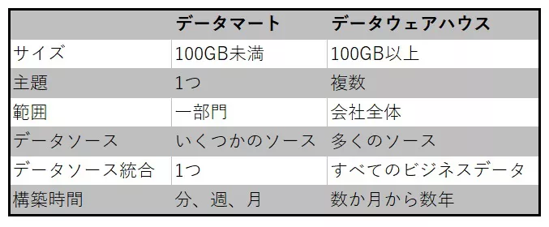

# 性能・拡張性
1. What  is through-put / IOPS / Latency
   * Through-put: How much data the machine is able to send and recieve (in bytes)
   * IOPS：IO means how many input and outputs a disk is able to read and write.(The access amount) IOPS means how many IO's the machine is able to perform in a second
   * Latency: How much time it took to delay when sending a certain content
  When you want to send and receive a large file, High through-put  will be needed. Whereas, when you have a lot of amount of files when sending the machine, you will need a high IOPS

# 信頼性・可用性
## RASISの基本について
R eliablity(信頼性):「障害の発生のしにくさ」のこと。具体的には、システムやサービスが使えなくなる頻度やその間隔を示す指標だ。平均故障間隔（Mean Time Between Failures）で表す。（故障までにどれくらいの時間がかかるか）   
A vailability(可用性): 「システムやサービスが利用できる時間の割合」のこと。稼働率で表す
S ervability(保守性):  
I ntegrity(保全性): 情報処理や電気通信の分野においては、データが全て揃っていて、欠損や不整合などがないことを示します  
S ecurity(安全性/完全性):  安全性は、システムにおいて利用されているデータに対し常に高いセキュリティを維持することです。ビックデータなどの利用が拡大するにつれて、システムが扱うデータも多くなっています。そうしたなかで、どのようにデータを安全に保持しておくかは重要なファクターです。

## RTO and RPO
### RPO（目標復旧時点）とは  
RPOとは「Recovery Point Objective」の略称で、日本語では「目標復旧時点」を意味します。RPOはシステム障害が発生した際に、過去の「どの時点まで」のデータを復旧させるかを表す目標値です。RPOの表し方は「0秒」「4時間」「1日」といったように期間で定義されます。例えば、 RPO が0秒の場合は「システム障害直前までに記録したデータを復旧させる」ことを指し、1週間の場合は「システム障害が発生する1週間前までに記録したデータを復旧させる」という意味になります。  
つまり、RPOの数値が小さければ小さいほど、より厳しいバックアップ体制が敷かれていることを意味し、その分運用コストも高くなります  
### RTO（目標復旧時間）とは  
RTOとは「 Recovery Time Objective」の略称で、日本語では「目標復旧時間」を意味します。RTOはシステム障害が発生した際に、「どのくらいの時間で（いつまでに）」システムを復旧させるかを表す目標値です。システムの利用者にとっては、サービスの中断やシステム停止が許される時間ともいえます。  
RTOは「〇時間」と時間で表します。例えばRTOが72時間の場合は、「72時間以内にシステムを復旧させなくてはならない」ことになります。  
RTOの数値はRPOと同様、ゼロに近ければ近いほど、システムが復旧するまでの時間を短くするためにバックアップ体制を強化する必要があります。その分運用コストも高くなります。  
Mean Time Between Failure: (MTBF):総稼働時間 /　故障回数  
Availability 稼働率：  稼働時間 / 総稼働時間  


# Network
## VPN
### IPSecVPN
## 閉域網接続
閉域ネットワーク（閉域網）とは、インターネットから切り離された独自のネットワークのことです。  
閉域ネットワークには、専用線とIP-VPN・広域イーサネットの3種類があり、それぞれ強みが異なります。
- Dedicated Line

- IP-VPN
- Long Range Ethernet


# API
## What is an api 
抽象概念：APIとは、わかりやすく言うと「アプリケーション同士を繋ぐもの」です。この記事では、APIの意味やAPI連携のメリットなどを詳しく解説しています。APIが使えるようになるまでの流れも紹介しているので、ぜひご覧ください。


### WEB API
Web APIとはAPIの一種で、日常的に利用しているWebブラウザーで用いられているHTTP/HTTPSプロトコル（通信規則）を用いてネットワーク越しにアプリケーション間で利用できるインターフェースです。
### REST API
「REST」とは「REpresentational State Transfer」の略称で、Webシステムの設計思想、概念であり前述のHTTP/HTTPSプロトコルのような規則ではありません。しかしながら汎用性が高く、その概念に沿った開発が容易であることからWeb APIで主流として用いられています。

### SOAP API

## 非同期処理/同期処理とは
イベントループ：タスクをスケジュールする
タスク：コルーチンを実行し、実行結果などを管理する
コルーチン：実行や一時停止ができる処理

```python
# 通常の関数(同期関数)
def main():
    print('hello world')

# コルーチン関数(非同期関数)
async def async_main():
    print('hello async world')

# コルーチンの実行
>> コルーチンを実行するにはasyncio.runをします。


```

# Data
## RDB / RDBMS / SQL and NOSQLの違いについて
RDBとは、表形式の複数のデータを関連付けて使えるように管理されたデータベースのことです。
- RDBMS製品名	特徴
  - Oracle Database	大規模なシステムでよく利用される。Oracle社の製品。
  - MySQL	Webシステムでよく使われる。オープンソース。
  - SQLServer	Windows上で動くシステムでよく利用される。Microsoft社の製品。
  - PostgreSQL	Webシステムでよく使われる。オープンソース。  

  【RDBMSのACID特性とは】　　  
ACID:  
A(Atomicity/ 原子性)：データ操作（トランザクション）は「全て実行されるか」「全て実行されないか」のどちらかしかない  
C(Conosistency/一貫性): データに一貫性があるというのは、データの重複や欠落がなくデータの整合性が保たれた状態ことです。  
I(Isolation/独立性):データ操作（トランザクション）の処理過程は、他に閲覧されることなく、他の処理に影響を与えることもない。
D（耐久性/永続性）:データ操作（トランザクション）が完了すれば、その結果が記録される。

NoSQLとは、「Not Only SQL」:
NoSQLはRDBのようにテーブル構造を表形式に固定することなく、さまざまな形式でデータを格納できることが特徴です。


https://business.ntt-east.co.jp/content/cloudsolution/column-338.html


## Hadoop / Spark の違いについて
### Hadoop
テラバイト（TB）の1,000倍のペタバイトレベルのデータを複数のストレージに保存し、複数のコンピュータに分散させて並行処理を行い、ビッグデータ処理の基盤を構築します。言語はJavaが使われ、処理を記述するだけでデータの分配や結果の統合などを自動処理することが可能です。
### Spark
Apache Sparkは、2009年にカリフォルニア大学バークレー校の研究から生まれました。Hadoopと比較して膨大なデータをリアルタイムで処理可能な高速性、データ変換を目的とした豊富な演算子と半構造化データのためのデータフレームAPIによる利便性、標準装備された高度なライブラリと複雑なワークフロー作成機能による統合性の特徴を持ちます。

### Databricks
Sparkベースの開発ソフトウェアであり、同時にデータレイクとデータウェアハウスのプラットフォームを提供するソリューションの名称になります。
## Datawarehouse vs Datamart
データマートとは、企業などで情報システムに記録・蓄積されたデータから、利用部門や用途、目的などに応じて必要なものだけを抽出、集計し、利用しやすい形に格納したデータベースのこと。「マート」(mart)は「小売店」の意。


## Why Datalakes?
- Unstructured data / High costs for only using Data warehouse storages and so on


# Kubernetes
## What is a Container?
Virutal Machine 
- Application  
- Hyperviser  
- OS   

Container  
- Application
- Container Engine
- OS

→ The OS layer won't matter. All you have to worry about is the Container Engine and the configuration file(Docker image).  
Merit    
→
In the image above, if you will create a web-server and database and messaging app in all in one viritual machine, there will be times of imcopablities of the server(Operation System ), and applications.
example 

## When to Use a virtual Machine and a container?

## Architecture
- Node
A unit that will run containers.
- Cluster
A unit that will orchestrate the nodes.
- Master 
A node inside a cluster that will manage the nodes inside the cluster.
- Components

- Pods
The smallest object in kubernetes. It has a one to one relationship with containers. However you can add a container which has a different objective to a single pod.


## Docker and ContainerD
https://zenn.dev/ttnt_1013/articles/f36e251a0cd24e
- history
Docker was first made in the container era (2013)   
Kubernetes was made and used to orchastrate containers (2014)
Kubernetes made a cri (container command line) for containers other than docker (2014)  
Docker used containerD for there low-level API - which made docker/containerD compatible for kubernetes (2015)

- 

### What is docker and containerD 
containerD is a low-level API of docker commands

### History
- What is CRI / OCI and what it had to do with docker
CRI is a command line interface that allows kubernetes to collaborate with other container engines like rkt and so on.
CRI was not comaptible for docker.

### ctr vs nerdctl vs crictl

- crt is a command line for containerD  mainly for debugging
- nerdctl command line for containerD which is more user friendly
- crictl command line for CRI

## Command line
``` sh 
kubectl run nginx --image=nginx
kubectl run nginx --image=nginx --restart=Never
kubectl get pods

# The ready state indicates the number of running containers and total number of containers
kubectl get pods -o wide
kubectl describe pod <name of the pod>
kubectl delete pod <name of the pod>
kubectl create -f <YAML File name>

# create a yaml file
kubectl run redis --image=redis123 --dry-run=client -o yaml > redis-definition.yaml

# Edit a pod
kubectl edit pod redis

# apply a different definition file
kubectl apply -f redis-definition.yaml

# get the replication controller
kubectl get repolicationcontroller

kubectl

```
```yml
apiVersion: v1
kind: Pod
# dictionary
metadata:
# only has name and labels
  name: myapp-pod
  labels:
    app: myapp
    type: front-end

spec:
  containers:
    - name: nginx-container
      image: nginx
```
## Confuguration
### Controller
Both are able to control how many containers are running. However replica sets are a newer concecpt
- Replication Controller
```YAML
apiVersion: v1
kind: ReplicationController
metadata:
  name: myapp-rc
  labels:
    app: myapp
    type: front-end
spec:
  template:
    metadata:
    # only has name and labels
      name: myapp-pod
      labels:
        app: myapp
        type: front-end

    spec:
      containers:
        - name: nginx-container
          image: nginx
  replicas: 3
```
- Replica Set
There is a selector to monitor and initiate pods that match the labels of the selector
```YAML
apiVersion: apps/v1
kind: ReplicaSet
metadata:
  name: myapp-replicaset
  labels:
    app: myapp
    type: front-end
spec:
  template:
    metadata:
      name: myapp-pod
      labels:
        app: myapp
        type: front-end
    spec:
      containers:
        - name: nginx-container
          image: nginx
  replicas: 3
  selector:
    matchLabels:
      type: front-end

```

## Other
- What is a namespace?
- What is a service?
